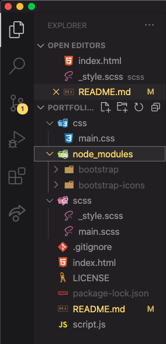

# Portfolio-With-Bootstrap

# Set all components to work on Sass and Bootstrap.

- First, we install Bootstrap `npm install bootstrap`.
- Second, we installed Sass `sudo npm install -g sass`.
- We can check for Sass version `sass --version`.
- We´ve created .gitignore for node_modules and package-lock.json.
- Create scss folder for "main.scss" and "_style.css".
- Create css folder for compilation with "Watch Sass".
- Final step is add bootstrap icons `npm i bootstrap-icons`

Note: "Watch Sass" will create main.css in the css folder automatically.

### ScreenShot Set Up

 
## Happy Coding 😜